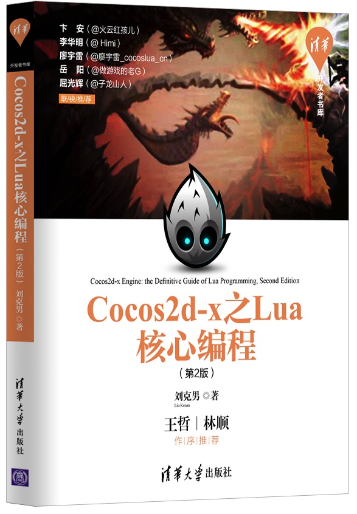

#  《Cocos2d-x 之 Lua 核心编程》第二版

|第二版封面|第一版封面|
|----|---|
|  |  |

## 网购通道

* 第一版：[京东](http://item.jd.com/11792827.html) [亚马逊](https://www.amazon.cn/gp/product/B01777XLV8) [淘宝](https://s.taobao.com/search?q=Cocos2d-x+%E4%B9%8B+lua+%E6%A0%B8%E5%BF%83%E7%BC%96%E7%A8%8B) [当当](http://product.dangdang.com/23800863.html)
* 第二版：[亚马逊](https://www.amazon.cn/dp/B073LWNDP6/)

## 配套代码下载

* 第一版配套代码[下载](https://pan.baidu.com/s/1bnfVURt)
* 第二版配套代码[下载](https://pan.baidu.com/s/1slwMuZV)

## 内容简介(第二版)

《Cocos2d-x 之Lua 核心编程（第2版）》是介绍Cocos2d-x Lua游戏核心开发技术的专业书籍。本书从 Lua 语言基础开始，全面介绍了Cocos2d-x Lua 的基础知识、进阶应用和高级编程技术，并以一款三消游戏开发实战贯穿书中的大部分知识点。全书贯穿理论结合实践的最佳编程学习方式，各个章节都提供配套实例。
本书第1～3章为基础知识章节，是使用Cocos2d-x Lua开发游戏的最小知识集合；第4章节和第6章以实际作品《Fruit Fest》展示了完整的游戏开发流程；第5章为游戏开发进阶知识，其中介绍的功能是绝大部分游戏都需要的，熟知他们可以在开发游戏功能模块的时候更加得心应手；第7～8章的高级编程技术，为游戏产品发布阶段提供有力支撑。

**《Cocos2d-x 之Lua 核心编程》第2版在第1版的基础上进行了内容扩充，增加了Spine骨骼动画、拆剪节点、渲染纹理、Lua Binding实战、OpenGL ES 2.0与shader编程和SDK接入等内容。**

本书适合Cocos2d-x Lua游戏开发初学者，亦可作为富有经验的Cocos2d-x Lua游戏前端开发工程师的参考手册。

## 本书章节（第二版）

 本书分八章,知识层面由浅入深、步步推进,建议按照顺序阅读。

* 第 1 章:介绍 Cocos2d-Lua 背景, Cocos2d 各版本之间的关系。
* 第 2 章:Lua 快速入门。已有 Lua 编程基础的读者,可跳过这一部分。
* 第 3 章:Cocos2d-Lua 基础。本章是开发游戏必需掌握的知识结构。
* 第 4 章:Fruit Fest 消除游戏的第一部分,实现了游戏的核心玩法。本章应用 Cocos2d-Lua 基础知识,展示了游戏开发的主要流程。
* 第 5 章:Cocos2d-Lua 进阶。涵盖 UI 控件、瓦片地图、内存管理以及数据存储等内容。
* 第 6 章:Fruit Fest 游戏的第二部分, 为游戏添加了音乐与粒子特效。
* 第 7 章:Cocos2d-Lua 高级内容。虽然其中的网络通讯和物理引擎不是每个游戏都用得到, 但它们是引擎必不可少的一部分。自定义事件、状态机为游戏系统架构供基础支撑, 而 Lua Binding 需要熟练掌握 C 语言开发,它们都是为高级工程师准备的。**第二版本章新加 Spine 骨骼动画 和 OpenGL ES 2.0等内容。**
* 第 8 章:打包与发布。之所以放在最后, 是因为 Cocos2d-Lua 为我们供的 Player 模拟器已足够应对游戏的前期开发,通过 Player 测试游戏将节省大量时间。**第二版本章新增SDK接入等内容。**

## 适用的 Cocos2d-Lua 版本

* 第一版，第1-7章适用于 Cocos2d-Lua v3.3 Final 以及 Quick-Cocos2dx-Community 3.6 ～ 3.6.5，第8章打包适用于3.3、3.6 ～ 3.6.3。
* 第二版，第1-7章适用于 Cocos2d-Lua v3.3 Final 以及 Quick-Cocos2dx-Community 3.6 ～ 3.6.5，第8章打包适用于 Quick-Cocos2dx-Community 3.6.4 ～ 3.6.5。

[引擎下载](../download/index.md)
