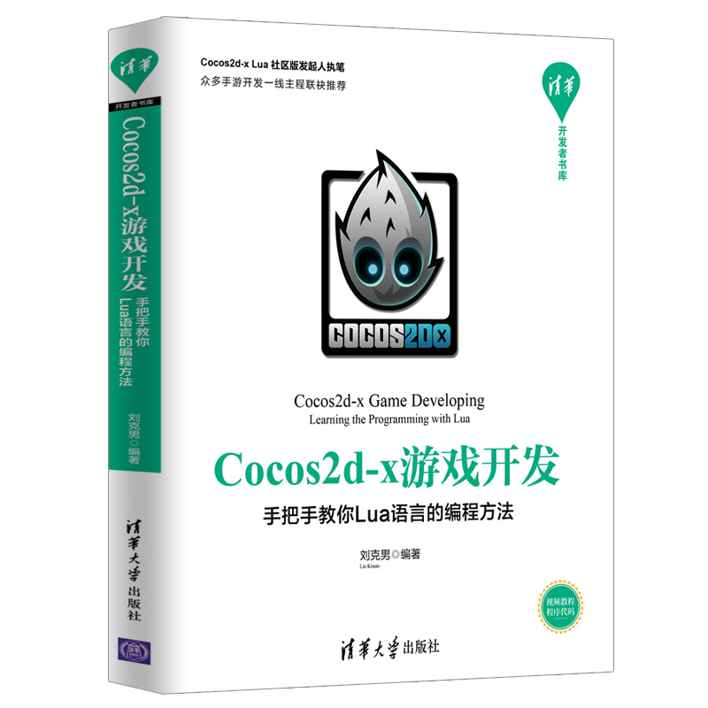

#  《Cocos2d-x游戏开发 手把手教你Lua语言的编程方法》

| Cocos2d-x游戏开发 手把手教你Lua语言的编程方法 | Cocos2d-x之Lua核心编程(第2版) | Cocos2d-x之Lua核心编程 |
| --- | --- | --- |
|  |  |  |

## 网购通道

* Cocos2d-x游戏开发 手把手教你Lua语言的编程方法：[京东](https://item.jd.com/12612857.html) [淘宝](https://s.taobao.com/search?q=手把手教你Lua语言的编程方法) [当当](http://product.dangdang.com/28501052.html) 
* Cocos2d-x之Lua核心编程(第2版)：[京东](https://item.jd.com/12223508.html) [亚马逊](https://www.amazon.cn/dp/B073LWNDP6/) [淘宝](https://s.taobao.com/search?q=Cocos2d-x+之+Lua+核心编程+第2版) [当当](http://product.dangdang.com/25112631.html)
* Cocos2d-x之Lua核心编程：[京东](http://item.jd.com/11792827.html) [亚马逊](https://www.amazon.cn/gp/product/B01777XLV8) [淘宝](https://s.taobao.com/search?q=Cocos2d-x+%E4%B9%8B+lua+%E6%A0%B8%E5%BF%83%E7%BC%96%E7%A8%8B) [当当](http://product.dangdang.com/23800863.html)

## 学习视频

[B站视频](https://space.bilibili.com/371659280)

## 配套代码下载

* 《Cocos2d-x游戏开发 手把手教你Lua语言的编程方法》书中二维码扫描下载
* 《Cocos2d-x 之Lua 核心编程》配套代码[下载](https://pan.baidu.com/s/1bnfVURt)
* 《Cocos2d-x 之Lua 核心编程（第2版）》配套代码[下载](https://pan.baidu.com/s/1slwMuZV)

## 《Cocos2d-x游戏开发 手把手教你Lua语言的编程方法》内容简介

《Cocos2d-x游戏开发 手把手教你Lua语言的编程方法》是基于社区3.7.x引擎编写的入门开发指南，也是一本参考手册。在发布社区版3.7以来，引擎进行了大刀阔斧的裁剪和改进。尤其是UI部分的变化，让老开发和新收都无从下手，本书对ccui框架进行了全方位的介绍，并结合CocosStudio进行说明。

本地配套录制了**10个讲解视频**，和书上的内容相辅相成，新手可以更快的上手游戏开发，老手也可以从中得到新的体会。

除了对全书进行更新，还新增了**UI控件、DragonBones、Protobuf、PushCenter等内容**，部分章节更新了个人积累的Lua封装实现。

附CCUI相关章节：

* 5.1 UI控件
* 5.1.1 输入控件
* 5.1.2 图片控件
* 5.1.3 进度条控件
* 5.1.4 滑动条控件
* 5.1.5 富文本控件
* 5.1.6 面板容器
* 5.1.7 滚动容器
* 5.1.8 列表容器
* 5.1.9 分页视图控件
* 5.1.10 视频播放控件
* 5.1.11 网页视图控件
* 5.2 Cocos Studio编辑器
* 5.2.1 UI编辑基础
* 5.2.2 分辨率适配
* 5.2.3 加载csb文件

## 适用的引擎版本

* 《Cocos2d-x游戏开发 手把手教你Lua语言的编程方法》**Quick-Cocos2dx-Community 3.7.0** 以上版本。
* 《Cocos2d-x之Lua核心编程》，第1-7章适用于 Cocos2d-Lua v3.3 Final 以及 Quick-Cocos2dx-Community 3.6 ～ 3.6.5，第8章打包适用于3.3、3.6 ～ 3.6.3。
* 《Cocos2d-x 之Lua 核心编程（第2版）》，第1-7章适用于 Cocos2d-Lua v3.3 Final 以及 Quick-Cocos2dx-Community 3.6 ～ 3.6.5，第8章打包适用于 Quick-Cocos2dx-Community 3.6.4 ～ 3.6.5。

[引擎下载](../download/index.md)
