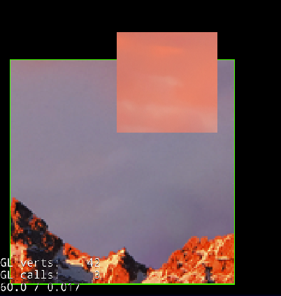

# 裁剪

引擎提供的裁剪有两种: cc.ClippingRectangleNode 和 cc.ClippingNode。

cc.ClippingRectangleNode 使用 OpenGL 的 `GL_SCISSOR_TEST` 裁剪测试进行矩形裁剪，多用于UI框架中，比如：ScrollView。

cc.ClippingNode 使用 `GL_STENCIL_TEST` 模版测试进行像素裁剪，多用于特效中。

## 矩形裁剪

Cocos2d-x 中的 cc.ClippingRectangleNode 一直存在嵌套使用裁剪区域异常的bug。另外，如果 cc.ClippingRectangleNode 和 cc.RenderTexture 同时使用，也会出现拆建区域异常的bug。

这两个问题已经在3.7中进行了修正，示例代码如下：

```
local rect = cc.rect(20, 20, 400, 400)
local shape3 = display.newRect(rect, {
		borderColor = cc.c4f(0,1,0,1),
		borderWidth = 2
	})
	:addTo(self)
local clipA = display.newClippingRectangleNode(rect)
	:addTo(self)
local spB = display.newSprite("11.png")
	:addTo(clipA)
	:pos(150, 150)

local spD = display.newSprite("22.png")
	:addTo(clipA)
	:pos(300, 380)
local clipC = display.newClippingRectangleNode(cc.rect(200, 200, 300, 300))
	:addTo(spB)

local btn = ccui.Button:create()
	:pos(display.right - 50, 50)
	:addTo(self)

btn:setTitleText("snap")
btn:setTitleFontSize(30)
btn:setTitleColor(cc.c3b(255, 255, 0))
btn:addTouchEventListener(function(sender, eventType)
	if 2 == eventType then
		local render_texture = cc.RenderTexture:create(display.width, display.height)
		render_texture:begin()
		self:visit()
		render_texture:endToLua()

		local photo_texture = render_texture:getSprite():getTexture()
		local sprite_photo = cc.Sprite:createWithTexture(photo_texture)
		sprite_photo:flipY(true)
		sprite_photo:scale(0.5)

		sprite_photo:addTo(self):center()
	end
end)
```

错误的裁剪效果如下：



正确的裁剪效果如下：


在这个示例中，点击snap按钮可测试 RenderTexture 和 ClippingRectangleNode 混用的特殊用法。

## 像素裁剪

cc.ClippingNode 可进行像素级裁剪，通过判断alpha来进行显示过滤。使用范例如下：

```
function MainScene:ctor()
	display.newColorLayer(cc.c4b(20, 9, 39, 255)):addTo(self)

	-- hold our new light button
	local lightNode = display.newNode()
		:center()
		:addTo(self)
	
	local button = cc.ui.UIPushButton.new({normal = "wechat.png"}, {scale9 = false})
		:onButtonClicked(function(event)
            print("==PushButton click")
        end)
		:addTo(lightNode)

	-- cliping for light
	local stencil = display.newSprite("wechat.png")
	local light = display.newSprite("light.png")
	local clip = cc.ClippingNode:create(stencil)
	clip:setAlphaThreshold(0.08)
	clip:addChild(light)
	clip:addTo(lightNode)

	-- moving action
	local size = stencil:getContentSize()
	local sizeLight = light:getContentSize()
	light:pos(-size.width / 2 - sizeLight.width, 0)
	light:runAction(cc.RepeatForever:create(
		cc.Sequence:create(
			cc.MoveTo:create(1.5, cc.p(size.width / 2 + sizeLight.width, 0)),
			cc.Place:create(cc.p(-size.width / 2 - sizeLight.width, 0)),
			cc.DelayTime:create(1)
		)
	))
end
```

## ccui.Layout 与 cc.ClippingNode

ccui 中的基础类 ccui.Layout 也使用裁剪，SCISSOR的bug已在3.7.1中修正，并设置为默认裁剪方式。

需要注意的是，如果 ccui.Layout 使用`GL_STENCIL_TEST`做裁剪，然后又嵌套使用了 cc.ClippingNode，会导致渲染效果异常，这是由于STENCIL嵌套导致的bug，目前还未找到解决的办法。

建议需要用 cc.ClippingNode 的地方使用自定义shader来实现同样的裁剪功能。