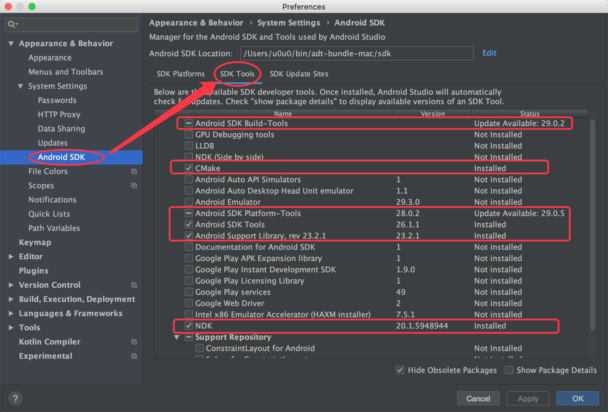
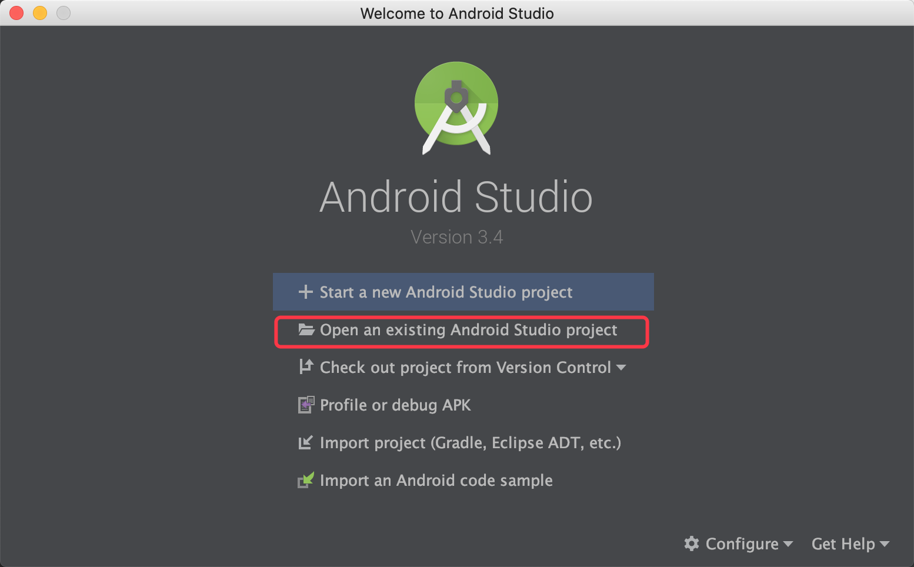

# cmake 编译

> 适用于 cocos2d-Lua 4.0 以上版本

假设项目路径为 `/Users/u0u0/Desktop/test`

## 环境需求

* CMake 3.14+
* Xcode 10+
* Visual Studio 2019
* Android Studio 3.4+，NDK r19c+

## 编译 Mac

```
$mkdir build_mac
$cd build_mac
$cmake .. -GXcode
$open test.xcodeproj
```

## 编译 iOS

需要`https://github.com/leetal/ios-cmake`

```
$mkdir build_ios
$cd build_ios
$cmake .. -GXcode -DCMAKE_TOOLCHAIN_FILE=../cmake/ios.toolchain.cmake -DENABLE_ARC=FALSE
$open test.xcodeproj
```

默认为iOS device 工程，调整为模拟器需添加`ios.toolchain.cmake` 支持 `-DIOS_PLATFORM=SIMULATOR64` 等平台参数，参考其文档。

## 编译 Android

安装 Android Studio 3.4+，在AS的 Preference => Android SDK => SDK Platforms 中勾选 Android 8.0。
在 SDK Tools中做如下图勾选安装：



打开 AS，导入游戏项目工程: `/Users/u0u0/Desktop/test/frameworks/runtime-src/proj.android`：



导入玩直接联机编译。

> Android 的 cmake编译，直接由AS自动完成，无需命令行参与。


## 编译 Win32

```
mkdir win32-build
cd win32-build
cmake .. -G"Visual Studio 15 2017"
cmake --build .
```