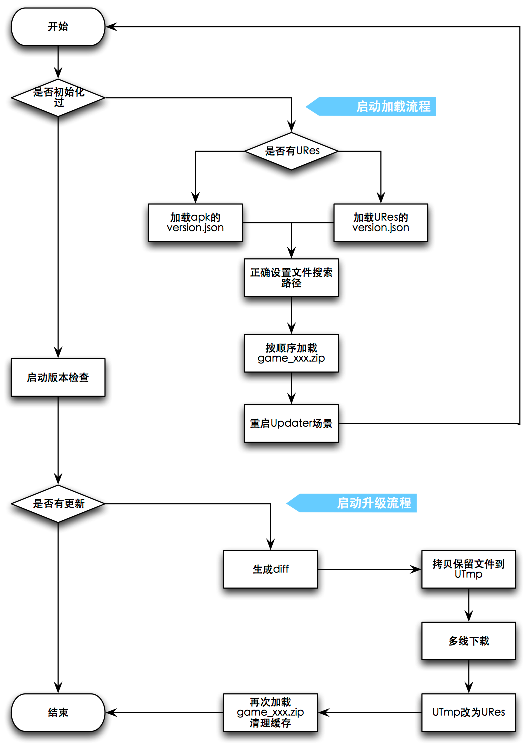

# 纯Lua的热更新方案

> 适用于3.7.1以及以后版本.

## 设计要点

1. 支持game.zip分包，但是基础包为game32.zip(game64.zip), 基础包必须含有Updater以及其界面代码。基础包由cpp自动加载。扩展包由lua加载。
2. 项目无需特别的结构调整，热更新模块基于引擎基础模块编写，对应UI需在独立的scene中完成。
3. 自动判断手机cpu位数，避免下载无用的game_xxx.zip.
4. 热更中程序退出，再次启动会自动判断已下载的文件，节省流量。
5. 不支持断点续传，对离散的文件下载更友好。
6. 支持多文件同时下载。
7. 只要引擎版本不变，可以任意版本直升。每个人下载的内容不一样。

## 使用注意项

1. 热更场景资源独立。
2. 热更场景代码不依赖任何其他模块，做到独立。
3. 避免在热更场景中使用全局变量。
4. 退出登陆回到热更场景时，清理游戏中初始化的各种数据和全局变量。

## Updater.lua

可在`https://github.com/u0u0/Lua-utils/blob/master/src/app/utils/Updater.lua`获取热更新核心逻辑代码。配套脚本工具位`https://github.com/u0u0/Lua-utils/blob/master/tools/GenResMD5.py`.

GenResMD5.py拷贝到项目的res同级目录下，命令行运行自动生成version.json文件。

用法示例：

```
local Updater = require("app.utils.Updater")

-- hot update scene
local LoadingScene = class("LoadingScene", function()
	return display.newScene("LoadingScene")
end)

function LoadingScene:ctor()
	-- call init before initUI
	Updater.init("LoadingScene", "http://127.0.0.1:8080/v1", function(code, param1, param2)
		print(code, param1, param2)
		if 1 == code then
			app:enterScene("MainScene")
		end
		-- TODO other code deal
	end)
	self:initUI() -- init Loading scene UI
end
```

## 设计流程图

