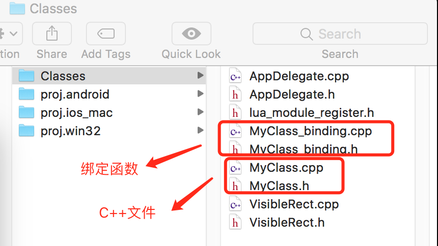

# 手动绑定 Lua 接口

## 前言

Quick 在 `Quick-Cocos2dx-Community/tools/bindings-generator` 有提供一个自动绑定的脚本。我认为这个工具只适合第一次绑定引擎的C++接口，它有一些固有缺陷。比如它对C的接口并不友好，类似spine这类c的runtime，有很多接口没有绑定出来。

在`Quick-Cocos2dx-Community/cocos/scripting/lua-bindings`下会看到auto 和 manual 两个目录。manual是手动绑定的lua接口，它完善了自动绑定不能解决问题。
同时自动绑定可能会有一些错误，后期有手动修正。

这里不建议再使用bindings-generator做绑定。

如果项目中需要自己从`C/C++`扩展Lua接口，本文意图引导你如何正确的在Quick中新加lua接口。

如果你仅仅是接入SDK，那么luaj和luaoc是绝对的优先选择。

## 测试类 MyClass

当我们新建一个项目后，在`luabinding/frameworks/runtime-src/Classes`下会有一个专门存放项目C++文件的路径。我建议所有项目定制相关的扩展都放在这里。这样当引擎更新的时候，可以以最小工作量升级引擎。



MyClass是一个最简单的类，只有一个print函数以便于我们测试绑定。
MyClass.h 声明如下：

```
#ifndef __MYCLASS_H__
#define __MYCLASS_H__

class  MyClass
{
public:
    MyClass();
    virtual ~MyClass();

    void print(void);
};

#endif  // __MYCLASS_H__
```

MyClass.cpp 实现如下：

```
#include <stdio.h>
#include "MyClass.h"

MyClass::MyClass()
{
}

MyClass::~MyClass()
{
}

void MyClass::print(void)
{
    printf("==This is myclass print\n");
}
```

## 绑定实现

在头文件MyClass_binding.h中，我们引用lua C api 与 `tolua++` 的有文件：

```
#ifndef __MYCLASS_BINDING_H__
#define __MYCLASS_BINDING_H__

extern "C" {
#include "lua.h"
#include "tolua++.h"
}
#include "tolua_fix.h"
#include "CCLuaEngine.h"

int luaopen_myclass_luabinding(lua_State *L);

#endif  // __MYCLASS_BINDING_H__
```

luaopen_myclass_luabinding 是实现绑定的函数，具体实现在MyClass_binding.cpp中：

```
#include "MyClass_binding.h"
#include "MyClass.h"

static int lua_myclass_create(lua_State* L)
{
    // 如果lua端用:，则第一个参数是self
    int argc = lua_gettop(L) - 1;
    if (argc == 0) {
        MyClass *a = new MyClass;
        tolua_pushusertype(L,(void*)a,"my.MyClass");
        // GC 函数绑定
        tolua_register_gc(L,lua_gettop(L));
        // 返回值个数
        return 1;
    }
    luaL_error(L,"lua_myclass_create in function 'create' .");
    return 0;
}

static int lua_myclass_print(lua_State* L)
{
    // 如果lua端用:，则第一个参数是self
    int argc = lua_gettop(L) - 1;
    MyClass *a = (MyClass *)tolua_tousertype(L,1,0);
    a->print();
    if (argc == 1) {
        // 获取Lua的函数，增加引用计数
        int handler = (toluafix_ref_function(L,2,0));
        // 调用Lua函数
        cocos2d::LuaStack* stack = cocos2d::LuaEngine::getInstance()->getLuaStack();
        stack->pushInt(10);
        stack->pushString("Hello Callback!");
        stack->executeFunctionByHandler(handler, 2);
        // 减少引用计数
        toluafix_remove_function_by_refid(L, handler);
    }
    return 0;
}

static int lua_myclass_finalize(lua_State* L)
{
    MyClass *a = static_cast<MyClass *>(tolua_tousertype(L,1,0));
    delete a;
    printf("==myclass freed\n");
    return 0;
}

static void lua_register_myclass(lua_State* tolua_S)
{
    // 注册userdata
    tolua_usertype(tolua_S,"my.MyClass");
    tolua_cclass(tolua_S,"MyClass","my.MyClass","",lua_myclass_finalize);

    // 开始绑定功能函数
    tolua_beginmodule(tolua_S,"MyClass");
        tolua_function(tolua_S,"create",lua_myclass_create);
        tolua_function(tolua_S,"print",lua_myclass_print);
    tolua_endmodule(tolua_S);
}

int luaopen_myclass_luabinding(lua_State *L)
{
    if (nullptr == L)
        return 0;

    tolua_open(L);

    // a global table, name space
    tolua_module(L,"my",0);
    tolua_beginmodule(L,"my");

    lua_register_myclass(L);

    tolua_endmodule(L);
    return 0;
}
```

cocos2d-lua 中使用了 `tolua++` 库来方便的实现`C++`接口绑定的脚本自动化，我们的手动绑定也依赖于它。以`tolua_`开头的api均属于`tolua++`库的接口。

### luaopen_myclass_luabinding

luaopen_myclass_luabinding 函数实现自定全局变量 my 的生成，每个函数的作用如下：

1. `tolua_open(L);`让tolua++准备好环境。
2. `tolua_module(L,"my",0);` 首先查找全局表 my，如果找不到则创建表 my。
3. `tolua_beginmodule(L,"my");`表 my 压栈。
4. `lua_register_myclass(L);` 定义属于my下的成员。
5. `tolua_endmodule(L);` my 出栈。

### lua_register_myclass

lua_register_myclass 实现具体的 MyClass 绑定，具体解析如下：

1. `tolua_usertype(tolua_S,"my.MyClass");`注册一个名为"my.MyClass"的usertype，usertype可以理解为`tolua++`定义好的一套lua类机制。
2. `tolua_cclass(tolua_S,"MyClass","my.MyClass","",lua_myclass_finalize);` 创建表MyClass并挂接到my下，同时为 usertype "my.MyClass" 指定析构函数。
3. `tolua_beginmodule(tolua_S,"MyClass");` 在为 MyClass 定义功能函数前，需要先把它压栈。
4. `tolua_function(tolua_S,"create",lua_myclass_create);` 绑定一个create的函数，并制定它对应调用的C函数。
5. `tolua_endmodule(L);` MyClass 出栈，保持栈平衡。

`lua_register_myclass`绑定对应的Lua代码如下：
```
local myclass = my.MyClass:create()
```

### lua_myclass_create

lua_myclass_create 实现具体的实例化过程，具体解析如下：

1. `lua_gettop(L)`获取Lua端传递过来的参数个数。
	由于是用`:`来调用的create，固第一个参数总是`my.MyClass`自己。
	于是我们`-1`修正来获得真正的参数个数。
2. `MyClass *a = new MyClass;` 生成真正的`C++`实例。
3. `tolua_pushusertype(L,(void*)a,"my.MyClass");` 用a来创建Lua的userdata数据类型，并用我们之前定义好的"my.MyClass" usertype作为工厂模版，给userdata预设好一系列的函数，以符合我们实例化的要求。
4. `tolua_register_gc(L,lua_gettop(L));` 这里还需手动注册一次GC，让我们一开始定义的析构函数生效。
5. `return 1;` 最后我们需要告诉Lua引擎，create函数返回的参数个数。

### lua_myclass_print

print函数是给具体的实例来调用的，在lua端应该用如下的方式调用：

```
myclass:print(function (a, b)
	print(a, b)
end)
```

在lua_myclass_print中可以接受到2个参数。

1. `MyClass *a = (MyClass *)tolua_tousertype(L,1,0);` 第一个参数myclass自己。
2. `int handler = (toluafix_ref_function(L,2,0));` 第二个参数为lua的函数句柄。toluafix_ref_function获取句柄的同时，给lua的函数引用计数加1，保证我们再次回调lua函数的时候不抛异常。

print中我展示了一个C++底层异步回调lua函数的机制，尽管我这里没有做真正的延迟处理，但是完全展示了如何调用lua端的函数。

```
// 调用Lua函数
cocos2d::LuaStack* stack = cocos2d::LuaEngine::getInstance()->getLuaStack();
stack->pushInt(10);
stack->pushString("Hello Callback!");
stack->executeFunctionByHandler(handler, 2);
```

最后需要给handle的引用计数减1.

```
toluafix_remove_function_by_refid(L, handler);
```

### lua_myclass_finalize

析构函数是lua在GC时触发的，在这里我们需要安全的销毁`C++`端创建的内存。

**是的，你注意到了，例子展示的是Lua来控制内存的方式绑定`C++`接口**。这也是我提倡的方式来绑定接口。

> Cocos2d lua层的双内存管理真心反人类。但基础于现在的架构，又不得不这样做。

## Lua 测试

完整的测试代码如下：

```
function MainScene:ctor()
    cc.ui.UILabel.new({
            UILabelType = 2, text = "Hello, World", size = 64})
        :align(display.CENTER, display.cx, display.cy)
        :addTo(self)

	local myclass = my.MyClass:create()
	myclass:print(function (a, b)
		print(a, b)
	end)
	myclass = nil
	collectgarbage("collect")
end
```

为了测试析构函数，我手动删除了 myclass，并手动触发了一次 Lua 的内存 GC。

> 请自行把4个`C++`文件加入到 Xcode 或 VS 工程，并编译测试。

输出结果：

```
==This is myclass print
[LUA-print] 10	Hello Callback!
==myclass freed
```

## 常用Lua参数获取方式

> 以下函数中 argPos 从1开始。

数字

```
flaot num = lua_tonumber(L, argPos);
```

布尔

```
bool is = lua_toboolean(L, argPos);
```

字符串

```
char *name = lua_tostring(L, argPos);
```

> 注：name的内存是lua在管理，如需在C端保留，自行拷贝一次。

