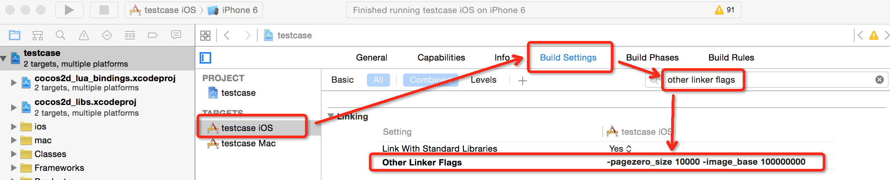

# Quick-Cocos2dx-Community 中 64 位 Luajit 使用说明

> 注：文档适用于 3.7.2 以及之前版本。3.7.3之后iOS模拟器自动设置，无需再单独设置。

在 3.6 中，我们加入了 Luajit 2.1 以支持 64 位 bytecode，并替换掉了原生lua。

Luajit bytecode 在不用的平台使用不同的位数支持。情况如下：

* Win32、Mac 继续使用32位的jit。
* Android、iOS更新硬件来决定使用的jit位数，5s以上设备使用64位jit，以下设备使用32位jit。

事实上每个平台都需要独立的luajit库支撑，引擎提供的luajit包含了各个平台的库，游戏开发者可放心使用。

**在大部分时候，你不需要感知Luajit的存在，依然像往常一样正常使用 Player 来开发游戏。**

以下两个情况是你需要注意的：

1. 使用 Xcode 的 iOS 模拟器来测试代码。如果你选择iPhone 5s或以上的模拟器，那么你需要在 project 的 **other linker flags** 中增加以下参数：

	```
	-pagezero_size 10000 -image_base 100000000
	```

	如下图所示：

    

    > 注意：iPhone 4s模拟器不需要设置。
    > 调试完成请去掉这个参数设置，否则AppStore上新检查将不能通过。

2. 游戏发布的时候，针对iOS你需要用 **[PackageScripts.py](../encryptlua/index.md)** 分别生产 32 和 64 位的 bytecode包，并在游戏启动逻辑加入系统位数判断，以启动不同的包。