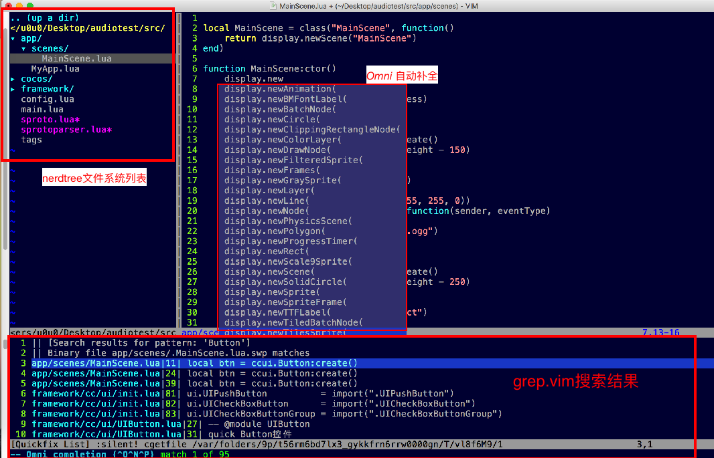

# 搭建基于 Vim 的 Cocos2d-Lua 开发环境

用脚本语言开发游戏，最大的障碍在于开发环境，cocos官方曾经有款失败的cocos code ide编辑器，早已停止开发。个人任务做好编辑器是个庞大的工程，参考Golang这样的开源项目，它的做法是做一套现有编辑器的插件，以支持Golang的开发。Quick之前的Sublime插件QuickXDev依然是这样的一个思路，然个人并不会开发sublime插件，vim插件懂一点点，于是把QuickXDev的主要功能开发了*vim-quick-cocos2d-x*插件。仅有*vim-quick-cocos2d-x*其实是不够的，你还需要一些配套的Vim插件以及设置来达到好用的状态。

我把自己Vim开发Cocos2d-Lua用到的配置整理出来，供大家参考。

## .vimrc 配置

这份配置很基础，个人不喜欢一堆插件，把一个编辑器搞得很复杂。
配置中的注释已经描述得很清楚，仅供参考。

```
" plugin to auto load plugins, Must before nocompatible
execute pathogen#infect()

" Use Vim settings, rather then Vi settings (much better!).
" This must be first, because it changes other options as a side effect.
set nocompatible

set guifont=Menlo:h16
"set guifontwide=Hei_Regular:h18

" code for edit in buffer
set enc=utf-8
" code for write to file
set fenc=utf-8
" code for read from file
set fencs=utf-8,ucs-bom,gb18030,gbk,gb2312,cp936
set fileformat=unix

set autowrite
set nu
set tabstop=4
set shiftwidth=4
set softtabstop=4
"set expandtab

" allow backspacing over everything in insert mode
set backspace=indent,eol,start

set nobackup		" do not keep a backup file, use versions instead
set history=100		" keep 50 lines of command line history
set ruler		" show the cursor position all the time
set showcmd		" display incomplete commands
set incsearch		" do incremental searching

" Switch syntax highlighting on, when the terminal has colors
" Also switch on highlighting the last used search pattern.
if &t_Co > 2 || has("gui_running")
    syntax on
    set hlsearch
endif

" Only trun on NERDTree on gui mode
if has("gui_running")
    autocmd vimenter * NERDTree
endif

" Only do this part when compiled with support for autocommands.
if has("autocmd")

    filetype plugin indent on
    syntax on

    " Put these in an autocmd group, so that we can delete them easily.
    augroup vimrcEx
        au!

        " For all text files set 'textwidth' to 78 characters.
        autocmd FileType text setlocal textwidth=78

        " When editing a file, always jump to the last known cursor position.
        " Don't do it when the position is invalid or when inside an event handler
        " (happens when dropping a file on gvim).
        autocmd BufReadPost *
                    \ if line("'\"") > 0 && line("'\"") <= line("$") |
                    \   exe "normal g`\"" |
                    \ endif

    augroup END

else

    set autoindent		" always set autoindenting on

endif " has("autocmd")

":colo evening
":colo torte
:colo darkblue

" for C indent type
set cino=t0

" F3 to Grep.vim
nnoremap <silent> <F3> :Grep -r <CR>

" setting from Partical Vim
" 1. 命令行模式，历史回硕映射
cnoremap <C-p> <Up>
cnoremap <C-n> <Down>
" 2. 命令模式中，%%来展开当前文件所在的目录
cnoremap <expr> %% getcmdtype( ) == ':' ? expand('%:h').'/' : '%%'
" 3. 激活%更多关键字跳转:def/end 等
runtime macros/matchit.vim

"vim-Cocos2d-x-lua
let g:cocos2dx_diction_location = '~/.vim/bundle/vim-quick-cocos2d-x/key-dict'
```

## 插件列表

* grep.vim (https://github.com/vim-scripts/grep.vim)
* vim-commentary (https://github.com/tpope/vim-commentary.git)
* vim-quick-cocos2d-x (https://github.com/u0u0/vim-quick-cocos2d-x)
* nerdtree (https://github.com/scrooloose/nerdtree.git)

Vim的插件管理个人推荐使用pathogen.vim插件。

### grep.vim

这个插件是用来解决多文件中字符串搜索，并实现跳转。它依赖与系统的grep等命令，Linux和unix系统是不在话下的，Mac支持起来也是完美。

用得最多的命令是`Grep xxx -r *`，所以做了一个F3的快捷键映射

```
nnoremap <silent> <F3> :Grep -r <CR>
```

光标移动到想要查询的单词上，按F3就可以快速搜索。

### vim-commentary

这个插件是用来快速注释代码的，它可以自动区分语言，用对应的注释符号给代码行添加注释。

用法：先shift+v进入块模式，上下移动光标选择需要注射的行，然后gc注释代码；
如果是已经注释了的行，gc则是取消注释。

### vim-quick-cocos2d-x

这个插件只做两件事情：

1. 使用快捷键`<C-x><C-o>`或`<Tab>`来触发函数自动补全。补全的函数是一个本地数据库文件，和python的自动补全插件类似，目前这个数据库文件覆盖的API并不完整，但可以很方便的添加。
2. 使用快捷键`<F5>`快速启动Player运行lua文件所在的游戏项目。

> 注意：ctrl+p的自动补全和Omni autocomplete的内容是分开的，你可以结合使用。

### nerdtree

这个插件用来在左边启动一个文件系统树状浏览器，方便在文件之前切换，最好只在gvim模式下启用，前面提供的vimrc配置中有体现。

技巧：在nerdtree窗口中按r可以刷新列表。

## ctags的Lua支持

ctags 与 vim结合非常强大，但是ctags官方对Lua的解析非常糟糕，几乎不能使用。不过ctags 提供了扩展机制，我们可以自定义Lua文件的解析规则，以达到正常索引的目的。

在src根目录下新建一个`.ctags`文件，其内容如下：

```
--langdef=MYLUA
--langmap=MYLUA:.lua
--regex-MYLUA=/^local[ \t]+([a-zA-Z0-9_]+)[ \t]*=[ \t]*\{/\1/v,var/
--regex-MYLUA=/[ \t]*([a-zA-Z0-9_]+)[ \t]*=[ \t]*function[ \t]*\(/\1/f,function/
--regex-MYLUA=/function[ \t]+([a-zA-Z0-9_]+)[\.:]([a-zA-Z0-9_]+)[ \t]*\(/\2/f,function/
```

在项目的src目录下运行如下的命令:

```
ctags -R .
```

这是会在src下多出一个tags的索引文件，只要用Vim打开tags同目录下的任意一个lua文件，tags就会被Vim自动加载。

> 注意tags自动加载的限时条件，也就是只能打开main.lua和config.lua才能自动加载。主要Gvim窗口不关闭，nerdtree中任意切换编辑的文件，ctag数据依然有效。

有了ctag，你可以`ctrl+]`跳转到光标所在的函数，在用`ctrl+t`跳转回来，而`ctrl+p`的自动补全列表也会使用ctag的数据。如此一来，你的自定义函数就能很方便的键入了。

## 一张完整的效果图

