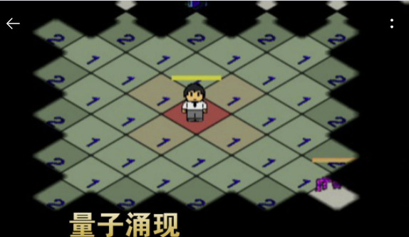

#  使用 Cocos2d-Lua 开发的游戏

## 独立游戏

* 军团战记-烽火
	* 
	* 简介: 这是一款策略+ARPG游戏。玩家将扮演一个军团长的角色，装备技能，招募将领，编制出战的兵种与阵容，然后带领你的军团去统一整个世界。除了自己的军团外，还能建立属下军团，属下军团是战是防，策略由玩家决定。
    * 作者: 观风游戏
    * TapTap 地址: https://www.taptap.com/app/134574
    * 引擎版本 Cocos2d-Lua-Community 4.0.2

* 量子涌现
	* 
	* 简介: 战棋+RPG，完全单机，个人独立制作，永不收费，永不接入广告，每周更新。装备多样，技能丰富，地图宏大，剧情饱满，怪物机制复杂，AI系统成熟。无限流剧情，打丧尸，斗魔神，战虫族，对抗地外超级智能，你能想到的，应有尽有。
    * 作者: 蓝熊工作室(http://bigbluebear.top/)
    * TapTap 地址: https://www.taptap.com/app/197720
    * 引擎版本 Cocos2d-Lua-Community 4.0.2