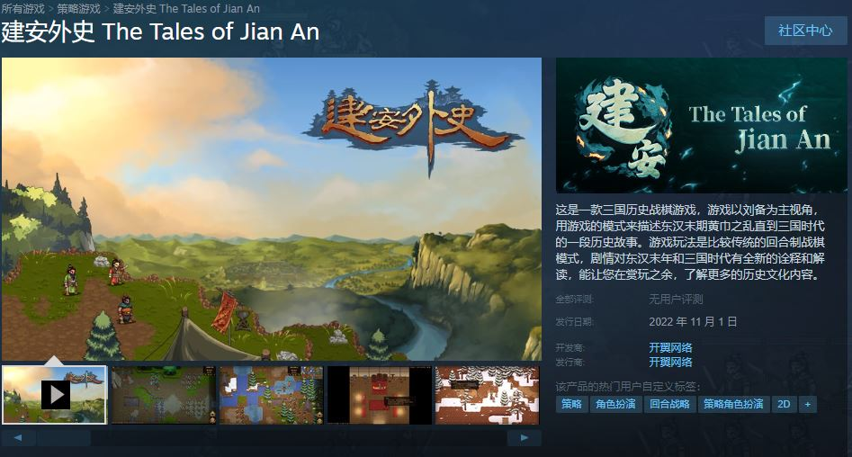

#  使用 Cocos2d-Lua 开发的游戏

## 建安外史

* 
* 这是一款非常传统的回合制战棋游戏。本作的游戏进程分为“剧情模式”和“战斗模式”。在剧情模式下，您可以欣赏到合乎汉末历史逻辑的，极其详尽的历史故事。本作不是真实的历史，本作没有“桃园结义”、“三英战吕布”、“温酒斩华雄”等熟知而老套的三国演义剧情，但我们的故事描写遵循《三国志》、《资治通鉴》、《后汉书》等历史文献的记载，并将其合理的虚构和扩展。在传统的回合制战斗模式下，我们也做了大量新鲜的、有趣的尝试和变化，“迷雾系统”、“天气系统”、“时辰变化系统”等等，为传统的战棋玩法加入了不少新意。
* 公司: 开翼网络
* steam 地址: https://store.steampowered.com/app/1973610/_The_Tales_of_Jian_An/
* 引擎版本 Cocos2d-Lua-Community 4.0.4

## 军团战记-烽火

* 
* 简介: 这是一款策略+ARPG游戏。玩家将扮演一个军团长的角色，装备技能，招募将领，编制出战的兵种与阵容，然后带领你的军团去统一整个世界。除了自己的军团外，还能建立属下军团，属下军团是战是防，策略由玩家决定。
* 作者: 观风游戏
* TapTap 地址: https://www.taptap.com/app/134574
* 引擎版本 Cocos2d-Lua-Community 4.0.2

## 北京麻将

* 
* 简介: 有版号，非常正经的棋牌。
* 公司: 乐享乐讯(http://www.beijingmj.com/)
* 引擎版本 Quick 3.3