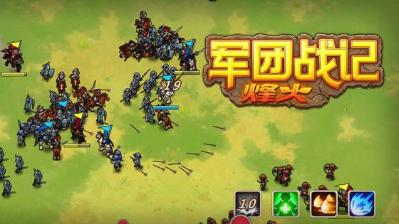

#  使用 Cocos2d-Lua 开发的游戏

## 独立游戏

* 军团战记-烽火
	* 
	* 简介: 这是一款策略+ARPG游戏。玩家将扮演一个军团长的角色，装备技能，招募将领，编制出战的兵种与阵容，然后带领你的军团去统一整个世界。除了自己的军团外，还能建立属下军团，属下军团是战是防，策略由玩家决定。
    * 作者: 观风游戏
    * TapTap 地址: https://www.taptap.com/app/134574
    * 引擎版本 Cocos2d-Lua-Community 4.0.2

## 公司产品

* 北京麻将
	* 
	* 简介: 有版号，非常正经的棋牌。
    * 公司: 乐享乐讯(http://www.beijingmj.com/)
    * 引擎版本 Quick 3.3