# “火焰纹章”战斗模块的实现

> 作者：[玛尼*卡缇](https://blog.csdn.net/weixin_44056716)

## 第一关预览

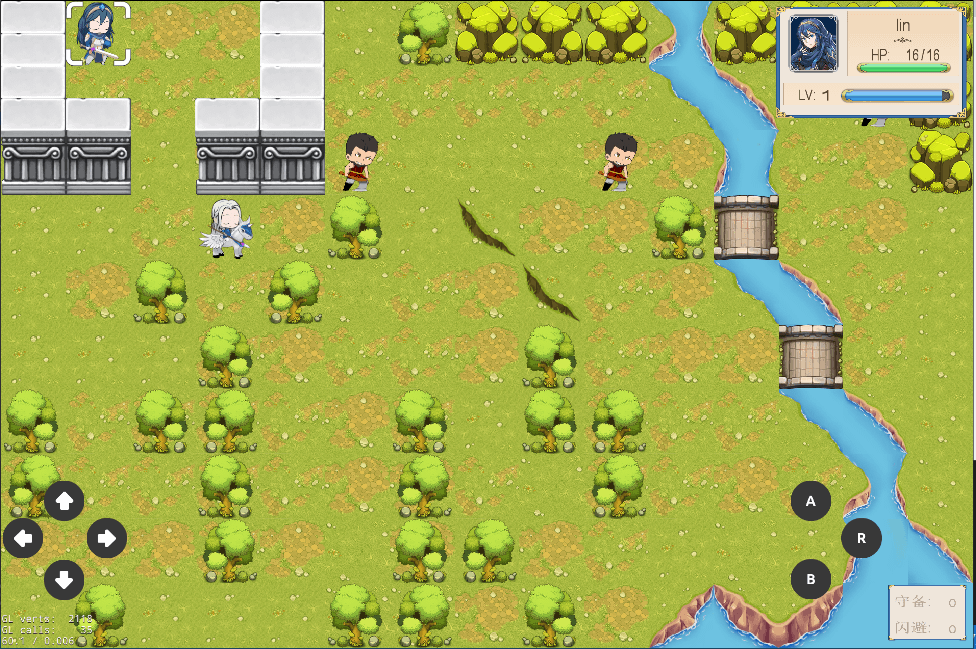

## 用到的软件

### 1.PngSplit

用于将整图分割为一个个的素材，对帧动画有特效

### 2.Cocos Studio

代码和UI分开操作,减少了程序和美术之间的交互冲突,提高了代码的保密性。功能强大且完善,编译测试方便简洁,但在游戏项目创建时要确定好横竖屏,否则如果后期产生变动会比较麻烦

### 3.tilemap

2d游戏地图创建,可分层和地图属性id预设

### 4.TexturePacker

sprite资源图集自动构建,帧动画和tilemap地图必备

### 5.Excel表格

RPG游戏必备,配值表存储大量的核心数据

### 6.引擎

Quick-Cocos2dx-Community 3.7.7

## Demo下载地址

链接: [huoyanwenzhang.zip](https://pan.baidu.com/s/1TC_K_N9KuM2OyTNSp3ZQYw) 提取码: m9s7

## 前期准备

### 配值表的创建与使用(RPG游戏配值表都比较多)

#### 总共生成的配值表

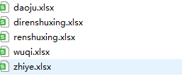

#### 表数据创建及注意事项

+ 表格第一行:给人看的

+ 表格第二行,第三行:给电脑看的

+ 表格第一列:不存具体数据(索引)

+ 注意:每写完一大类物品,空出一些行数方便以后扩展。写下一大类物品时,第一列id需计算空出的行数

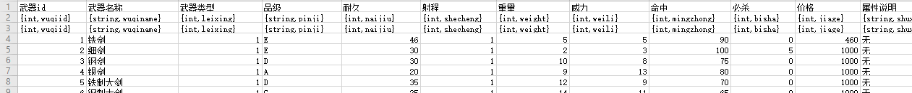

#### 生成对应的LUA文件

+ 第一个文件存所有的配值表

+ 第二个文件用来生成配值表对应的LUA文件

+ 第三个文件用来清空之前生成的LUA文件

+ 本游戏生成的LUA文件存放于huoyanwenzhang\src\app\config

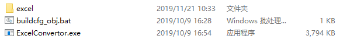

#### LUA文件在代码中的使用

敌军通过等级和对应的职业获取对应的属性(小兵太多,属性直接定死)

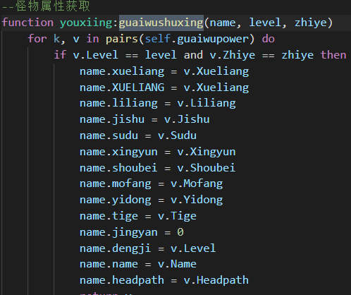

友军通过人物的姓名(英文)获取对应的初始属性(之后的属性都是由升级后随机成长)

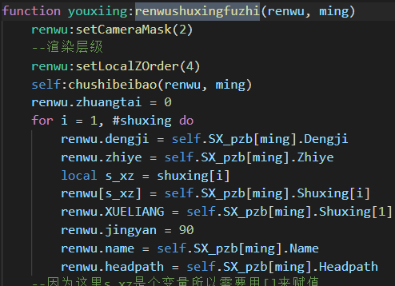

## 游戏玩法及代码概述

### 友军寻路:

选定人物后,做一次寻路遍历,获取所有人物能够走到的位置并添加高亮(注意地形和敌我双方对角色寻路的影响),并且预生成移动箭头,需计算角度。

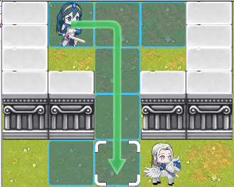

再次按下确定后,执行寻路动画(寻路的起点和终点就是人物角色的位置和光标当前位置),并逐步删除方向箭头和改变人物坐标达到人物移动的效果。

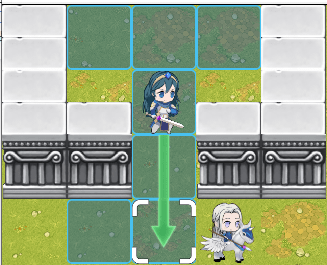

寻路核心代码:

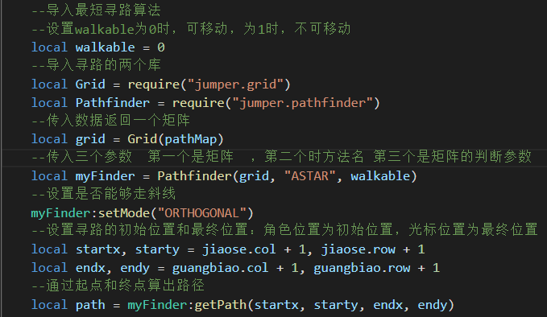

路径及箭头方向生成代码:

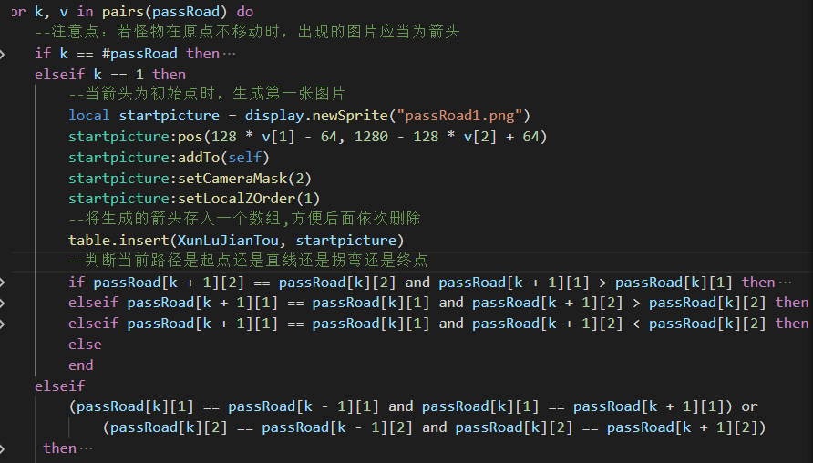

### 人物操作流程及界面:

相当于给人物设立了状态机,能够让人物执行一系列操作。例如:

#### 1.道具的使用和武器的装备:

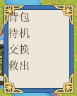
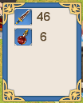

创建背包代码如下:

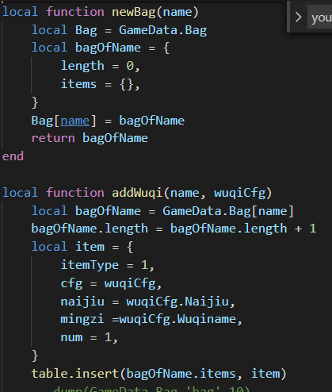

#### 2.友军阵营物品交换

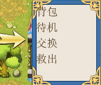
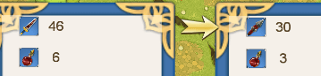

代码如下:

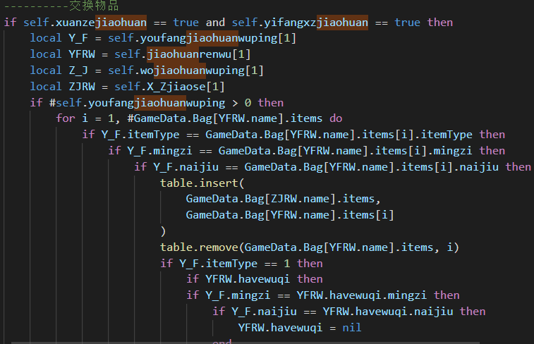

#### 3.待机指令:

待机即为该角色本回合所有操作执行完毕,不能再被选中，该界面是选中按钮点击非角色单位所产生,即待机的人物被视作此回合透明(调整角色状态即可)

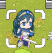
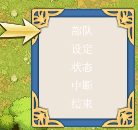
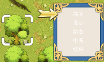

#### 4.主动攻击:

移动到敌对角色四周则可进行主动攻击,点下攻击按钮后,可在四周选择自己要攻击的角色

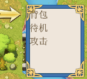
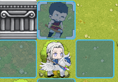

几种攻击情况的判定代码:

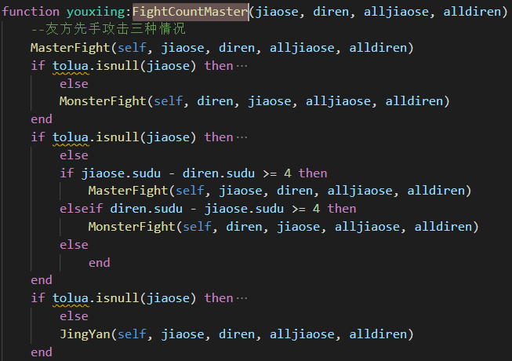

tolua.isnull作用：一个自定义参数，在c佳佳中已经被删除，但是lua还存在其地址，则进行判断c佳佳中的值是否为空

table类型：当定义的一个参数被删除，但其他地方还有引用的时候参数不会被删除。地址也不会被删除，遵循lua规则

userdata类型：当定义一个参数被删除，但其它地方还有引用的时候，参数会被删除，参数底下的自定义参数也会被删除。但是地址不会被删除。同时遵循lua和c++规则，产生冲突

#### 5.攻击预览:

确定要攻击的对象后,选择自己要使用的背包内的一把武器;选定武器后,获取攻击预览面板,即对伤害结算的预测,再次点下确定后,进行伤害结算和经验的增长

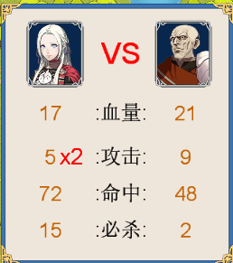
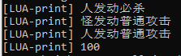

伤害结算代码:

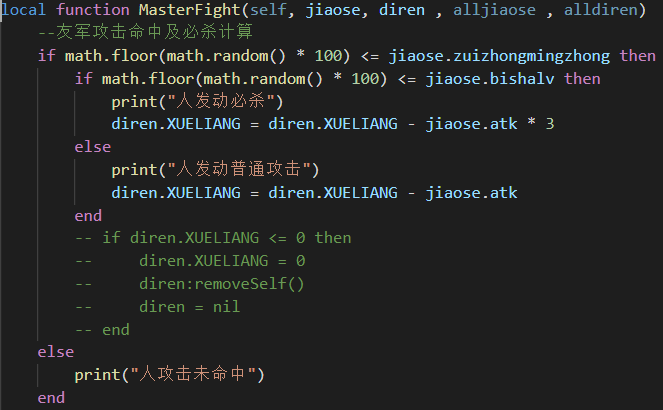

#### 6.角色升级:

若经验超过100,则提升角色等级,并按照成长率增长各项属性:然后减少100点经验,重新积累经验直到能够再次升级

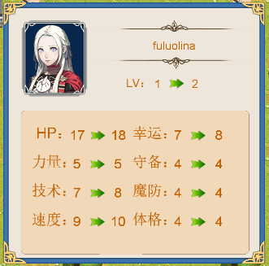

经验计算及升级代码:

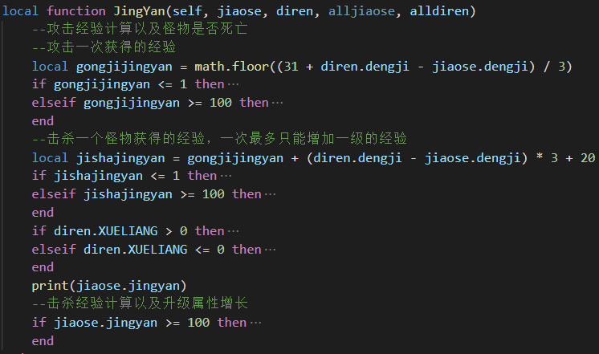

#### 7.角色详细属性一览:

点击R键即可获取该角色的详细数据

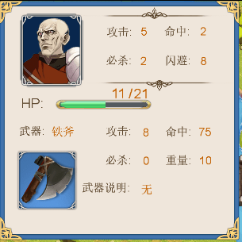

代码如下:

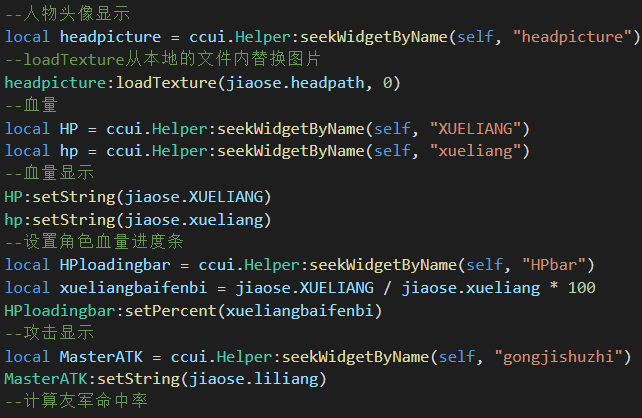

#### 8.角色简略属性及地图属性:

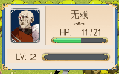

人物简略属性代码:

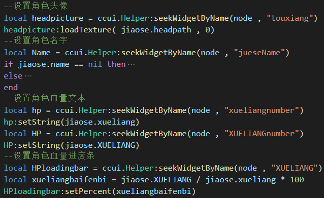

获取地图属性代码:

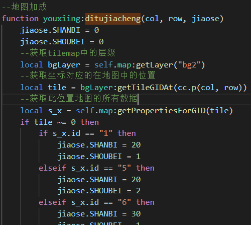

### 敌军寻路及攻击:

在所有友方角色执行完操作后,进入敌军回合,怪物会依次执行寻路操作,基于:

+ 寻路原理:通过tilemap的id，生成一格二维数组地图。0表示可移动，1表示不可移动。导入jumper文件，选用ASTAR寻路算法，同时设置不能走斜线，输入起点坐标和终点坐标就可进行寻路

代码如下:

pathMap具体数据为:

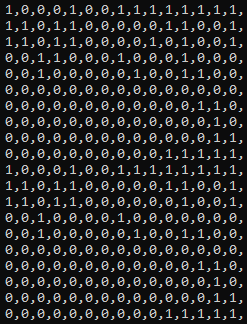

+ (若在行动范围内无可攻击的对象)获取友军单位的坐标，遍历寻路，找距离自己最近的单位进行寻路，同时根据动力限制每回合行动的距离

代码如下:

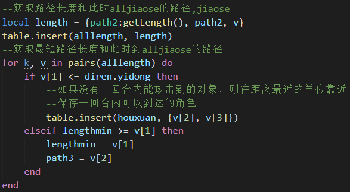

+ (若在行动范围内有两个及以上可攻击对象)获取友军单位的详细属性,进行优先级判定:血量最少>防御力最低>攻击力最低>闪避率最低

代码如下

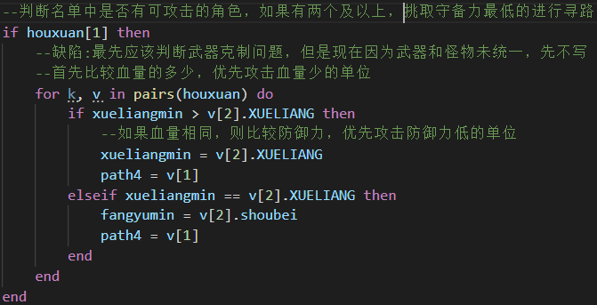

+ 寻路完成后进行攻击选择(到达寻路终点后,可能周围有两个以上敌对单位)

代码如下:

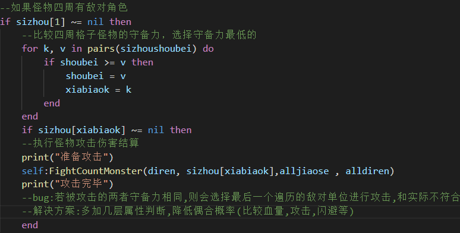

#### 最终效果:

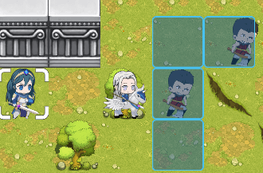
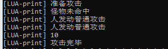

## tilemap的使用

### 精灵图组id设置:

对图组的所有图片都设置不同的id,方便代码中对于地图属性的编写

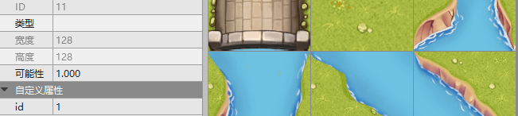

### 地图分层创建:

+ 底层:铺一层草地,作为背景,对角色无影响

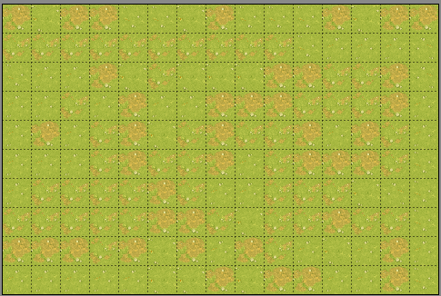

+ 地形层:不同的地形对于角色有着不同的属性加成或者限制

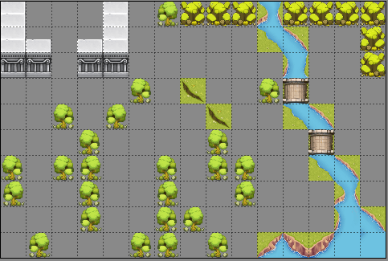

+ 怪物层:由于怪物的初始位置是事先定好的,因此可通过地图上标记来生成怪物,注意点为:在程序中需将这些结点的图片隐藏,只需要获取这几个结点的坐标即可

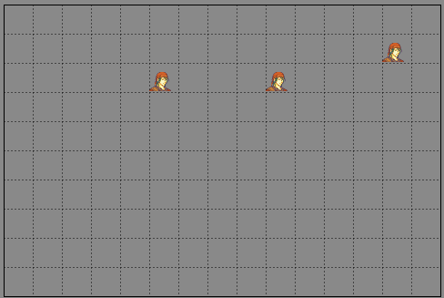

## TexturePacker的使用

### 导入帧动画美术资源:

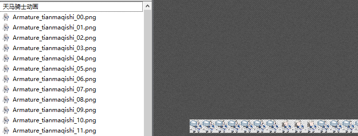

### 导出plist,png格式精灵帧动画图组:

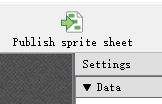
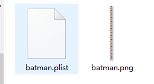

## cocos2d-x精灵帧动画制作:

代码解析:

1.加载两个图组文件

2.将精灵帧图片确定播放顺序

3.确定这些图片循环一次需要的时间

4.生成动画

5.循环播放该动画

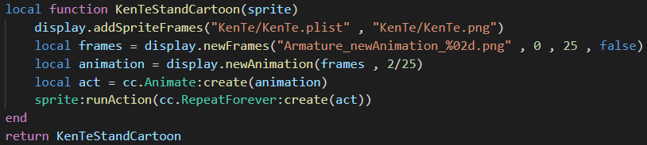

## 存在的缺陷:

###bug:

+ 1.按键保护未完成:在寻路等动作进行时,若按下其他按钮,会造成不可预知的错误

+ 2.游戏层级不够美观:由于许多图片创建时的父节点不相同,导致层次调整变得迷离

+ 3.人物切换武器,属性未即时更新

+ 4.怪物未创建背包,怪物和其武器是两个同级的变量

+ 5.怪物重合问题:寻路算法中做了寻路后，脚下是否有友军的判定(疑似判定失效)。可能原因：角色的坐标发生偏移无法进行重合检测判定，导致重合。

### 怪物AI不够完善:

+ 1.怪物寻路时，会根据行动力判定周围是否有能攻击的对象，但是由于地形的原因，导致理想行动力大于真实的行动力。表现为：怪物有时不会看自己周围的怪物，而是去寻找血量少的在自己理想行动力里的怪物，并且最终无法攻击到目标。原因：理想行动力下，怪物能够攻击到血少的怪物，但是由于地形，使得真实行动力缩小，怪物可能在路上就无法行动了。

+ 2.怪物具备多把武器时,应当会智能切换武器,血量少时,应当会逃跑和加血

+ 3.只实现了初级AI,怪物还是不够灵动,完整版本应当如同象棋(大师级)一样,使玩家痛并快乐。

### 职业系统未完善:

+ 1.不同职业在不同地形上的表现形式应当有所区别

+ 2.不同职业所能佩戴的武器应当有所限制

+ 3.职业在行动力及属性上的优劣

+ 4.转职系统未实现(不仅仅是二转,更应当能够改变基本职业(参照《三国志英杰传》))

### 资源不够充足:

+ 1.无 行走动画,攻击动画,被击动画,升级动画

+ 2.无音效(各类音效都缺)

+ 3.无剧情(游戏主线都么得emmm)