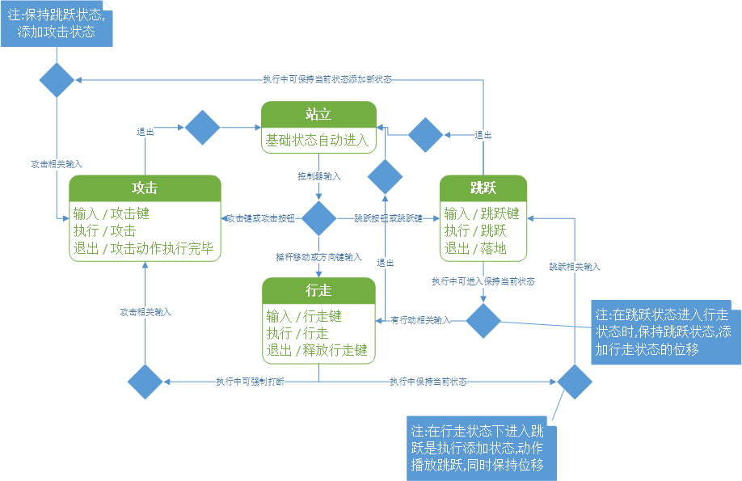
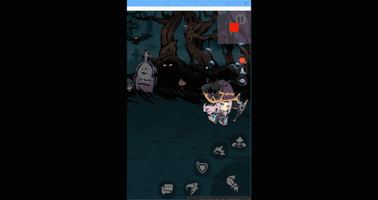
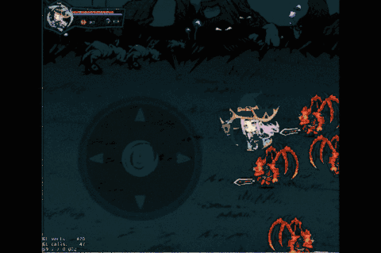
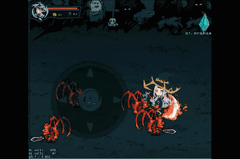
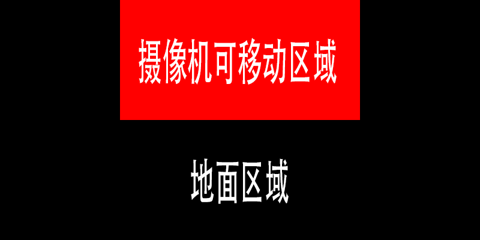
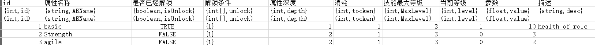
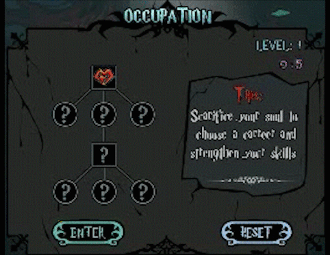
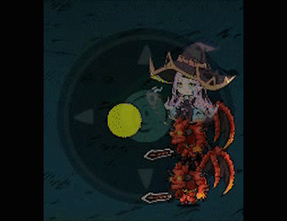
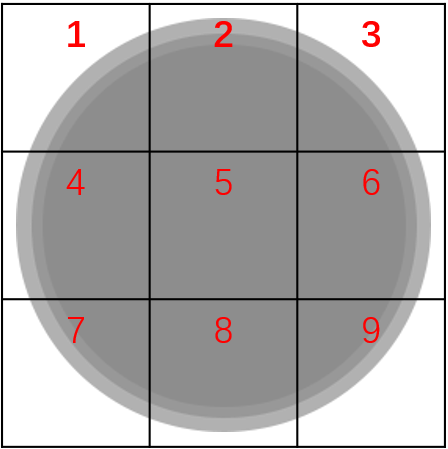

# Roguelike横板动作类游戏开发总结

## 使用的工具

* Quick-Cocos2dx-Community 3.7.7 (游戏引擎)
* vscode (写代码)
* cocos studio (用于场景UI搭建)
* Excel (用于写配置表)
* GitKraken (GIt管理软件用于版本控制)
* dragonBonesPro (用于对龙骨资源进行调整)
* Haroopad (用于写markdo文档进行思路整理与功能分析)

## 游戏核心功能

- *随机迷宫*
- *随机掉落*
- *人物动作系统*
- *摄像机系统*
- *职业与天赋树系统*
- *玩家操作系统*
- *存档系统*

## 人物动作系统

### 一. 状态模式[^REFERENCE1]

人物的动作系统核心我采用了状态模式来实现,人物的动作主要有**跳跃,攻击,行走,站立**四个状态。

*切换关系如下 :*
 
- 站立状态为初始状态可切入其他任意状态.
- 在攻击时不可行走和跳跃.
- 在行走时攻击会强制停在原地进行攻击.
- 在跳跃时攻击会保持跳跃同时进行攻击.
- 在行走时跳跃会同时保持两个状态.
- 在跳跃时行走会保持跳跃的动作同时移动.
- 当无操作输入时自动进入站立状态.

*状态之间的关系如图所示 :*


*实现思路 :*

* 将各个状态定义成一个独立的方法(函数),方法内实现相应的动作
* 使用调用器来切换不同的状态,换句话说使用出口和入口调用不同的状态
* 使用数组达到不互斥的状态可以同时进入的效果


*具体实现 :*

1. 实现状态模式(内部方法,外部无法直接访问)

	```
	state.moveLeft()--向左移动
	state.moveRight()--向右移动
	state.moveUp()--向上移动
	state.moveDown()--向下移动
	state.jump()--跳跃
	state.normalATK()--普通攻击
	state.skill1ATK()--技能1
	state.skill2ATK()--技能2
	state.skill3ATK()--技能3
	```
2. 留出入方法(外部方法,用于间接访问内部方法)

	```
	--切换状态该方法在外部调用 用来改变动作 actions 为字符串数组
	function playerState.changeState(actions)
    	statesGet = actions
	end
	--执行状态 该方法在外部调用 用于执行存储完毕的动作 利用lua的泛型for循环实现
	function playerState.goAction()
    	for _, v in pairs(statesGet) do
        	state[v]()
    	end
	end
	```
3. 调用

	```
	stateArr=['moveLeft','jump']
	playerState.changeState(stateArr)
	playerState.goAction()
	```

### 二. 主角动画播放

我使用了**龙骨动画[^REFERENCE2]**来播放播放龙骨动画。核心API在于
`db = dragonBones.CCFactory:buildArmatureDisplay('龙骨名称')` 获取骨骼
`ani = db:getAnimation()` 获取动画器
在获取了以上两个关键变量后 我们利用
`ani:play("动画名称")` 第一次动画播放
`anistate = ani:fadeIn('动画名称')` 对于播放的动画进行切换
`anistate:setResetToPose(false)` `attackState:addBoneMask("骨骼名称")` 完成两个需要同时进行的动作的动画融合

**效果如下**


相关代码:

```
--加载龙骨的函数
local function loadTheDBAnimation(self)
    -- json 只需解析一次, runtime 自带 cache 功能
    if not app._isLoaded then--避免重复缓存
        dragonBones.CCFactory:loadDragonBonesData("animations/samllMajio/smallMajio_ske.json")
        dragonBones.CCFactory:loadTextureAtlasData("animations/samllMajio/smallMajio_tex.json")
        app._isLoaded = true
    end

    local db = dragonBones.CCFactory:buildArmatureDisplay("Armature小魔女角色--加载骨骼
    local ani = db:getAnimation()--获取动画器
    ani:play("stay")--播放初始动画
    return db
end
--------------------------------------------------
--遍历获取的状态,如果有移动状态,就播放移动动画
 for k, v in ipairs(statesGet) do
    if v == "moveUp" or v == "moveDown" or v == "moveLeft" or v == "moveRight" and not ani:getState("attack") 
    and not ani:getState("bigMagic") then
     --播放奔跑动画
        if not ani:getState("walk") then
            if ani:isCompleted() or ani:getState("stay") then
                local walk = ani:fadeIn("walk", 0.01)
            end
        end
    end
end
```

### 三. 人物的行走范围

我使用了**事件分发器**来完成。

通过`app.Pushcenter.addListener('事件名',回调函数,self)`来接收每次切换房间时房间的大小与位置信息。

在人物切换房间的方法内添加`app.Pushcenter.pushEvnet('事件名',房间信息)` 来发送在获取了房间信息后对信息进行计算。

得出我所需要的边界信息得出边界信息后。

在人物移动的方法里每帧进行判断。

判断当前角色位置加上角色大小是否在边界内若超出边界则无法再往外移动, 但是行走动画照常播放。

实现代码:

```lua
--获取并计算可行走的区域的边界
app.PushCenter.addListener(
        "overTheBond",
        function(walkable)
            local walkableSize = ccui.Helper:seekWidgetByName(walkable, "walkable1"):getContentSize()
            bondLeft = walkable:getPositionX()
            bondRight = bondLeft + walkableSize.width
            bondBottom = walkable:getPositionY()
            bondTop = bondBottom + walkableSize.height
        end,
        roleOfPlayer)

--判断是否超出了边界,判断是否正在攻击,如果两个条件有任一满足,则之间返回,不进行移动
if roleOfPlayer:getPositionX() - roleOfPlayer:getBoundingBox().width * 0.2 <= bondLeft or ani:getState("attack") 
or  ani:getState("bigMagic") then
        return
end
roleOfPlayer:setPosition(roleOfPlayer:getPositionX() - moveSpeed, roleOfPlayer:getPositionY())
```

**效果如下 :**



### 四. 存在的缺陷

1. 状态模式实现比较简陋,使用了不少状态针,有违状态模式实现的初衷
2. 部分状态逻辑有问题,导致状态切换不是很流畅
3. 边界判定方法比较简易,当人物跳跃时可以跳出下边界

## 摄像机系统

### 一. 最初的摄像机

摄像机最初是非常简单的跟随角色移动,导致了玩家的画面中可以看到不少没有渲染的区域,如下:



实现代码:

```
local posX = app.alltheTabel.player:getPositionX()--角色的x坐标
local posY = app.alltheTabel.player:getPositionY()--角色的y坐标
camera:pos(posX - display.cx, posY - display.cy)--减去一半的屏幕大小将角色居中
```

### 二. 优化过后的摄像机

在借鉴Itay Keren先生对于相机控制的研究的文章[<<横版游戏的摄像机移动理论与实践>>](https://www.gcores.com/articles/111493)后,我做了一定的优化,使用了一个摄像机窗体的变种方法实现相机跟随,效果如下:



### 三. 实现思路

在这里我依旧使用了之前在人物边界控制的方法,获取了当前房间的信息,不过与之前不同的是,我的摄像机的边界比人物的行走的边界要小很多,如下图所示:



摄像机的移动边界和地面边界所相差的区域是我的设计分辨率的一半,为的是让摄像机能完全显示当前场景却不超出场景.
优化代码1计算边界:

```
app.PushCenter.addListener(
--添加监听事件
        "overTheBond",
        function(map)
        --计算上下左右边界
            bond.left = map:getPositionX() + display.cx--减去屏幕一半的屏幕宽度
            bond.right = map:getPositionX() + map:getContentSize().width - display.cx
            bond.bottom = map:getPositionY() + display.cy
            bond.top = map:getPositionY() + map:getContentSize().height
        end,
        camera
    )
```

优化代码2边界判断: 这一段在移动摄像机之前进行

```
if posY >= bond.top then
	posY = bond.top
elseif posY <= bond.bottom then
	posY = bond.bottom
end
if posX >= bond.right then
	posX = bond.right
elseif posX <= bond.left then
	posX = bond.left
end
```

### 四. 缺陷

目前只是简单有一个相机的跟随,但对于摄像机的运镜没有任何处理,比如人物跳起&落地时&当人物被攻击时&放大招时应有相应的摄像机反馈,缺少这些运镜手段使得游戏的打击感无限下降.

## 职业与天赋树系统

### 一. 天赋树功能分析

1. 实现一个可交互的天赋加点界面
2. 允许清空所有的天赋点进行重置
3. 实现天赋之间的解锁关系（举例：第一层天赋当点满5级后，解锁第二层天赋）
4. 用一张天赋的配置表实现调整修改所有参数
5. 在满足某一职业的条件下解锁该职业


### 二. 具体实现

1. 交互设计:
 	1. 属性Btn被点下时(BEGAN)应完成:
 		1. 图标被选择的特效
 	2. 属性Btn被释放时(ENDED)应完成:
        1. 判断能否解锁,若能解锁执行解锁相关步骤:
            1. 更换属性图标 如由灰色转为亮色
            2. 更新数据中的是否解锁的值由 false 改为 true
            3. 关闭被选中特效
        2. 若无法解锁,则执行
            1. 提示无法解锁提示方式根据当前未达成的条件提示
            2. 关闭被选中特效
        3. 解锁条件为:
            1. 前置属性要求已经解锁(前置属性要求根据配置表roleAttributeData表中的解锁条件查看)
            2. 当前属性点(token)满足属性消耗
            3. 当前属性未升级到最大属性
        3. 属性Btn被取消时(CANCELD)应完成:
            1. 关闭被选中特效
2. 配置表:
	1. 表中应有属性独有的Id,名称,是否已经解锁,解锁的前置条件,所需属性点的个数,属性最大等级,当前等级,属性参数等关键值
	如图所示 :
3. 交互界面与配置表之间的联动
	在脚本中通过拷贝的方式引入配置表后将其上的数据与属性按钮绑定,每一次点击过后将该属性对应的数据进行更新,在更新过数据后,刷新UI界面完成交互效果
4. 存储已经点击了的属性
	在玩家点击进入游戏后将玩家配置的属性点信息存入本地,这一步是为了影响游戏中角色的相关属性和效果

**实现效果如下:**




## 玩家操作系统

在玩家操作系统这方面我写了两种操作方式键盘操作和虚拟按键操作,一种用于应对电脑端,一种应对移动端

按键和键盘操作没什么复杂的地方就是简单的注册事件,唯一需要注意的就是因为lua这边没有对键值进行常量绑定,所以需要自己去测键值

在操作系统这里最重要的地方应该是摇杆和对应的调用人物动作系统的相关状态

### 一. 摇杆

先看看实现效果:



这个摇杆实际上只有摇杆的背景注册了触摸事件,那个摇杆只是给人视觉上的效果

这个实现是先监听触摸事件,然后获取触摸点的位置

在获取了触摸点的位置之后将摇杆向触摸点的位置移动

关于这个摇杆的边界实际上很简单,通过对比摇杆和摇杆背景中心点的距离来判断是否会超出边界

当超出边界时将摇杆阻拦

边界上点的计算:

```
local function caculateTheBoundPosOfCircle(x0, y0, x1, y1, r)
    local angle = math.deg(cc.pGetAngle(cc.p(x0, y0), cc.p(x1, y1)))
    local x2 = x0 + r * math.cos(angle * math.pi / 180)
    local y2 = y0 + r * math.sin(angle * math.pi / 180)
    return cc.p(x2, y2)
end
```

通过上面这个函数来计算边界上点的位置,这个函数实现思想是通过计算角度然后转换成弧度,再带入圆方程中算出边界点
`cc.pGetAngle(cc.p(x0,y0),cc.p(x1,y1))`这个方法是获取角度值
在返回了x2,y2之后我们就能将摇杆设在边界上同时看上去可以有种很圆滑的感觉

### 二. 调用人物状态

在控制系统中我用了一个table类型的变量states来存储我每一次操作所对应的动作状态
在键盘和按钮中states的变化很简单,就是单纯的按下按键然后在states中插入相对应的状态,释放按键就从states中移除这个状态

较为复杂的是摇杆中对应的移动状态,因为我在人物动作系统中写了四个方向独立的状态来控制移动,所以在这里我需要对这四种进行不同的处理

处理方式就是将摇杆背景逻辑上划分为9格(如下图所示),然后判断摇杆所处的区域,比如我的摇杆在3号区域时,我的states中就存入向上和向右两个状态



实现代码例如下面所示:

```
local thePercent = rockerBG:getContentSize().height / 6--划分的区域的大小

local xOffset = posOfrocker.x - circlePointPos.x--获取x,y的偏移量,摇杆相对于圆心的偏移
local yOffset = posOfrocker.y - circlePointPos.y
if xOffset >= thePercent then
	if findTheStateOfArr("moveRight") then
		table.insert(stateArr, "moveRight")
	end
elseif xOffset <= -thePercent then
	if findTheStateOfArr("moveLeft") then
		table.insert(stateArr, "moveLeft")
	end
end
```

在states状态存入时,我注册了一个节点自定义事件来调用在动作系统中留下的两个接口,如下:

```
player:schedule(function()
    playerstate.changeState(stateArr)
    playerstate.goAction()
end, 0.01)
```
这样就可以达到在玩家输入控制时,角色给予及时的动作反馈

### 三. 缺陷

因为没有做平台的判定导致两套操作方式都同时在运行,从而使得游戏运行效率可能有所降低

[^REFERENCE1]: [游戏设计模式/Design_Patterns_Revisited](https://gpp.tkchu.me/state.html)
[^REFERENCE2]: [龙骨动画API](http://developer.egret.com/cn/apidoc/index/name/dragonBones.Bone)
